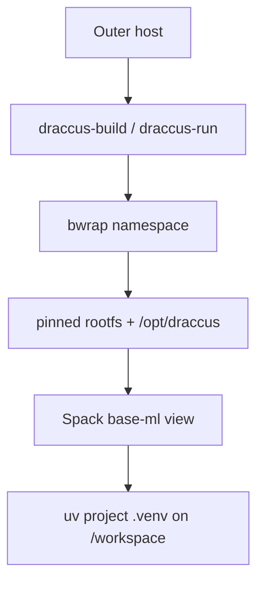

# Draccus: Canonical bwrap + Spack ML Foundation

**Status:** Draft for implementation review (adapted to this repository)
**Date:** 2026-05-10
**Primary audience:** AI/ML research engineering, infrastructure engineering, cluster/runtime maintainers
**System name:** Draccus
**Canonical runtime prefix:** `/opt/draccus`

---

## 0. Mental model (read this first)

Draccus is **a path contract enforced by a sandbox**, with two layered package managers stacked above it. It is *not* a container runtime, *not* a security boundary, and *not* a Spack distribution. The whole design exists to keep one promise:

> Inside the sandbox, the ML foundation always lives at `/opt/draccus`, on a pinned rootfs, with `torch`/`jax`/CUDA in a single coherent ABI graph — regardless of where the bundle physically sits on disk.

Everything else — Spack envs, uv overlays, validation gates, pre-commit hooks — is scaffolding that protects that promise.

### The three-tool decomposition

| Tool | Role | Why this one |
|------|------|---|
| **bwrap** | Namespace + path remap. Mounts host `$DRACCUS_BUNDLE/...` onto canonical `/opt/draccus/...` and pinned rootfs onto `/`. | Userland-only (no daemon, no root); supports `--ro-bind-data` for surgical `/etc` overlays atop a read-only rootfs; remaps paths without copying. |
| **Spack** | Builds the heavy ABI-coupled foundation: CUDA 13.1.1, cuDNN 9.17+, NCCL 2.29+, MKL, FFmpeg, **torch 2.10.0** (CUDA without MAGMA), **jax/jaxlib 0.9.1**, NumPy/SciPy, all on `cuda_arch=100` (B200, SM 10.0), `python@3.12`. | Concretizer unifies a single ABI graph; views (`link: all`, symlink) give a flat `/opt/draccus/view/base-ml` prefix that looks like `/usr/local` to consumers. |
| **uv** | Per-project venv (`uv venv --system-site-packages`) for fast-moving Python: `transformers`, `datasets`, `vllm`, `flash-attn`, etc. | Fast resolver, and — critically — `--system-site-packages` lets the venv *see* Spack's torch/jax without shadowing them. |

The layering invariant — **never let uv install anything on the do-not-shadow list** (`torch`, `jax`, `jaxlib`, `numpy`, `scipy`, `triton`, `nvidia-*`) — is the single most load-bearing rule in the system. `scripts/validate_uv_layering.sh` is its enforcement mechanism.

Structural enforcement is provided by `bin/draccus-uv` (the preferred way to invoke `uv` inside the namespace) together with `UV_EXTRA_OVERRIDES` pointing at `scripts/uv_overrides.txt`. This file is bound at `/opt/draccus/uv_overrides.txt` for every `draccus-run` / `draccus-uv` session, giving the uv resolver the highest-precedence constraints so it never satisfies foundation packages from PyPI or a project lockfile.



Spack and uv never cross layers; validation enforces it.

---

## 1. Repository and bundle root

This directory **is** the Draccus bundle. Physical storage may live anywhere; launchers resolve the bundle root automatically.

| Concept | Location |
|--------|----------|
| **Physical bundle (`DRACCUS_BUNDLE`)** | Directory containing `bin/`, `lib/`, `envs/`, `state/`, … Defaults to the parent of `lib/` via `lib/draccus-env.sh`. Override with `DRACCUS_BUNDLE` if needed. |
| **Canonical prefix inside bwrap** | `/opt/draccus` only — never the host path. |
| **Spack checkout & installs** | Bound from `$DRACCUS_BUNDLE/state/spack` → `/opt/draccus/spack` |
| **Views** | `$DRACCUS_BUNDLE/state/view/{base-sys,base-ml}` → `/opt/draccus/view/...` |
| **Caches / build** | `$DRACCUS_BUNDLE/cache`, `$DRACCUS_BUNDLE/build` |
| **Pinned rootfs** | `$DRACCUS_BUNDLE/rootfs` → `/` inside the namespace |
| **Environment sources (VC)** | `envs/base-sys/spack.yaml`, `envs/base-ml/spack.yaml` (mirror under `/opt/draccus/envs` only after copy/bootstrap; authoritative copies live here in git) |
| **Launchers** | `bin/draccus-run`, `bin/draccus-build`, `bin/draccus-offline`, `bin/draccus-shell`, `bin/draccus-debug-shell`, `bin/draccus-probe` |
| **Rootfs bootstrap** | `scripts/bootstrap-rootfs.sh` (Docker export of `nvidia/cuda:13.1.1-cudnn-devel-ubuntu24.04` by default; set `DRACCUS_ROOTFS_MODE=debootstrap` for legacy Debian bookworm) |
| **Validation** | `scripts/validate-static.sh` (Gate 0, GPU-free), `scripts/validate-all.sh` (14-gate full suite), plus per-gate scripts under `scripts/` |
| **Development enforcement** | `.pre-commit-config.yaml` (shellcheck + shfmt + ruff + Gate 0 on every commit), `CLAUDE.md` (persistent Claude Code session rules) |
| **Bundle resolution helper** | `lib/draccus-env.sh` |

You no longer need to hardcode the bundle path in scripts — set `DRACCUS_BUNDLE` or rely on auto-detection.

---

## 2. Executive summary

Draccus core is three tools working together:

- **bwrap** – mandatory sandbox/namespace (`draccus-run`, `draccus-build`, `draccus-offline`) that presents a stable `/opt/draccus` prefix and pinned rootfs.
- **Spack** – builds and installs the ML foundation inside the sandbox (`draccus-build` + `envs/base-ml/spack.yaml` → `base-ml` view). Owns torch, jax, jaxlib, numpy, scipy, CUDA, cuDNN, NCCL, MKL, FFmpeg, etc. (Torch is built `~magma`; CUDA dense LA uses NVIDIA libraries.)
- **uv** – manages upper-level, fast-moving ML libraries in per-project virtualenvs (`uv venv --system-site-packages` + `uv pip install transformers ...`).

---

## 3. Baseline and motivation

### 3.1 Problems addressed

| Problem | Mitigation in this repo |
|--------|-------------------------|
| Path instability | Canonical `/opt/draccus` inside bwrap; Spack state under `$DRACCUS_BUNDLE/state` |
| Environment sprawl | Two production envs only: `base-sys`, `base-ml` (`envs/*/spack.yaml`) |
| Over-broad CUDA | CUDA requirements only on CUDA-aware packages in `base-ml`, not `packages:all` |
| Fast Python churn | uv overlay; Spack foundation stays in views |
| Weak runtime contract | Mandatory `draccus-run` / `draccus-build` entrypoints |
| No canonical rootfs | `rootfs/` + `scripts/bootstrap-rootfs.sh` |

### 3.2 Goals, non-goals, assumptions

Canonical paths; mandatory bwrap; pinned rootfs; Spack for heavy deps; uv for fast Python; mise for orchestration; collapse to `base-sys` + `base-ml`; lockfiles under VC; B200 → `cuda_arch=100`, `TORCH_CUDA_ARCH_LIST=10.0`; Python **3.12** foundation in `base-ml`.

**Non-goals:** Draccus is not an OCI runtime; it does not create GPUs; it does not manage high-level ML Python via Spack.

**Assumptions:** `bwrap` available; GPUs/driver libs exposed by the outer environment when needed; sufficient disk under `$DRACCUS_BUNDLE`.

---

## 4. Path contract — the actual "design"

### 4.1 Outside vs inside bwrap

**Outside bwrap** (host):
```
$DRACCUS_BUNDLE/                  ← resolved by lib/draccus-env.sh (parent of lib/)
├── rootfs/                       ← pinned distro (Docker export of nvidia/cuda:13.1.1-cudnn-devel-ubuntu24.04)
├── state/spack/                  ← Spack checkout + opt tree + envs
├── state/view/{base-sys,base-ml} ← unified symlink farms
├── cache/{spack,uv,huggingface}  ← writable caches
├── build/stage                   ← Spack build scratch
└── envs/{base-sys,base-ml}/spack.yaml   ← VC'd manifests
```

**Inside bwrap** — same bytes, different names:
```
/opt/draccus/{spack,view/base-sys,view/base-ml,cache,build,envs}
/workspace                        ← $DRACCUS_WORKSPACE (default $PWD)
/                                 ← ro-bind from rootfs/
```

This is the entire point of the system: Spack installs that hard-code their own prefix (rpaths, scripts, `.pc` files, CMake configs) remain valid because the prefix never moves. The host can mount `$DRACCUS_BUNDLE` anywhere — the artifacts don't know or care.

`lib/draccus-env.sh` does the host-side resolution (parent of `lib/`); `DRACCUS_BUNDLE` can override for non-standard layouts. Inside, `DRACCUS_PREFIX=/opt/draccus` is set by every launcher.

### 4.2 Physical layout (this repository)

```
$DRACCUS_BUNDLE/
├── bin/           draccus-run, draccus-build, draccus-offline, draccus-shell, draccus-debug-shell, draccus-probe
├── lib/           draccus-env.sh, draccus-bwrap-env.sh, draccus-nvidia-mounts.sh
├── rootfs/        pinned distro rootfs
├── state/
│   ├── spack/     Spack repo + opt tree + environments
│   └── view/base-sys, base-ml
├── cache/spack, uv, huggingface
├── build/stage
├── envs/base-sys/spack.yaml, base-ml/spack.yaml
├── scripts/       bootstrap-rootfs.sh, validate-*.sh, prune-draccus.sh
└── projects/      optional convention for pinned projects
```

---

## 5. Launchers — run vs build

Both launchers are 99% identical; the only meaningful diff is **bind mode**:

| Mount | `draccus-run` | `draccus-build` |
|---|---|---|
| `state/spack` → `/opt/draccus/spack` | `--ro-bind` | `--bind` |
| `state/view` → `/opt/draccus/view` | `--ro-bind` | `--bind` |
| `envs/` → `/opt/draccus/envs` | `--ro-bind` | `--bind` |
| `cache/`, `build/`, `$workspace` | `--bind` | `--bind` |

Everything else — namespaces (`--unshare-user/ipc/pid/uts`), proc/dev/sys, tmpfs `/tmp` and `/run`, env contract — is shared. `draccus-offline` is `draccus-run` + `--unshare-net`. `draccus-shell` is `draccus-run bash` with **base-ml before base-sys** on `PATH` (Torch/JAX). `draccus-debug-shell` is the same except **base-sys before base-ml** (infra/debug).

| Mode | Command | Spack writable | Network |
|------|---------|------------------|---------|
| Run | `bin/draccus-run` | No | Yes unless offline |
| Build | `bin/draccus-build` | Yes | Yes |
| Offline | `bin/draccus-offline` | No | No (`--unshare-net`) |

**Device pass-through:** NVIDIA device nodes and `/usr/local/nvidia` when present; `/dev/infiniband` when present.

### 5.1 Subtle bits in the launchers

- **`--ro-bind-data` for `/etc/resolv.conf` and `/etc/hosts`** (`bin/draccus-run:55-66`). Because `/` is `--ro-bind` from `rootfs/`, you cannot overlay individual files with normal binds. The launchers open the host file as an fd (`exec {FD}<...`) and pass `--ro-bind-data $FD /etc/resolv.conf`. bwrap reads from the fd at startup and materializes the content under tmpfs. This is how DNS still works inside a read-only rootfs.
- **NVIDIA driver discovery** (`lib/draccus-nvidia-mounts.sh`). Driver libs are not in the Spack graph (they ship with the host kernel module). The script `ldconfig -p`'s the host, greps `libcuda.so / libnvidia-ml.so / libcudadebugger.so`, dedupes the parent dirs, and `--ro-bind-try`s each into the same path inside. Plus `/usr/local/nvidia` if present, plus `/dev/nvidia*`, `/dev/nvidia-caps`, `/dev/infiniband`. This is the boundary where Draccus stops being hermetic — driver ABI is inherited from the outer host.
- **CUDA toolchain discovery** (`lib/draccus-bwrap-env.sh`). Prefers Spack `view/base-ml/bin/nvcc` when present, falls back to rootfs `/usr/local/cuda*/bin/nvcc` (Docker layout). Exports `DRACCUS_RESOLVED_CUDA_HOME` so the launcher can set `CUDA_HOME`/`CUDA_ROOT` correctly. Globs all `cuda-*/bin` directories and stacks them into `PATH`/`LD_LIBRARY_PATH`. This is what makes the bundle usable *before* Spack is bootstrapped — you can `draccus-build` with only the Docker rootfs in place.

---

## 6. Environment contract (set by every launcher)

```
DRACCUS_PREFIX=/opt/draccus
SPACK_ROOT=/opt/draccus/spack
SPACK_{SYS,ML}_VIEW + DRACCUS_{SYS,ML}_VIEW   ← same path, two names
SPACK_USER_CACHE_PATH=/opt/draccus/cache/spack
UV_CACHE_DIR=/opt/draccus/cache/uv
HF_HOME=/opt/draccus/cache/huggingface
CUDA_HOME, CUDA_ROOT       ← Spack view if nvcc present, else rootfs CUDA
TORCH_CUDA_ARCH_LIST=10.0  ← sacrosanct, B200
PYTHONNOUSERSITE=1         ← kills ~/.local site-packages leakage
HOME=/workspace            ← every project sees its own $HOME
PATH = base-ml/bin : base-sys/bin : <rootfs-cuda-bins> : /usr/local/sbin:/usr/local/bin:...
LD_LIBRARY_PATH = /usr/local/nvidia/lib(64) : <rootfs-cuda-lib64> : /usr/local/cuda/lib : base-ml/lib(64)
```

The default `PATH` ordering — `base-ml` *first*, then `base-sys` — means `python` resolves to the ML foundation (torch/jax) out of the box. Set `DRACCUS_PREFER_SYS_PATH=1` (or use `draccus-debug-shell`) to reverse the order for infra/toolchain work. In both cases, Spack views win over rootfs, and rootfs CUDA only fills in where Spack hasn't.

---

## 7. Design principles

1. **Build where you run** — Bootstrap Spack only inside `draccus-build`.
2. **Spack heavy, uv fast, mise orchestration-only.**
3. **Two environments** — `base-sys` (no CUDA stack), `base-ml` (CUDA + ML).
4. **Never apply CUDA globally** — Only package-specific `requires:` in `envs/base-ml/spack.yaml`.

Source specs in-repo: **`envs/base-sys/spack.yaml`**, **`envs/base-ml/spack.yaml`**.

### 7.1 Spack design choices that matter

Looking at `envs/base-ml/spack.yaml`:

- **`packages:all: target: [x86_64_v3]`** — broad CPU floor, not `icelake` (open question; see Appendix A).
- **`+shared` globally** — needed for view symlinks and Python ext modules.
- **`%c=gcc@12.4.0`** for C/C++/Fortran — single compiler so the ABI graph is uniform.
- **`packages:cuda: require @13.1.1`** — pin must match the rootfs Docker tag (`nvidia/cuda:13.1.1-...`) so driver-API surfaces line up.
- **Per-package CUDA requirements**, never global. `py-torch`, `py-jaxlib`, and `nccl` carry `cuda_arch=100`; torch is intentionally `~magma`. Applying CUDA to `packages:all` would force CUDA variants onto things like `cmake` and explode build time.
- **`concretizer.unify: true` + `reuse: true`** — single DAG. This is what guarantees the torch/jax/numpy ABI compatibility uv depends on.
- **`duplicates: minimal`** with bumped allowances for `python: 2`, `cmake: 2`, `gcc: 2`, `llvm: 2`. Necessary because Spack's ML stack tends to want bootstrap-pythons and meta-build-pythons.
- **`padded_length: 128`** on `install_tree` — gives rpath relocation headroom (Spack pads install prefixes so binaries can be relocated by buildcache install). Side effect: `sys.path` in the Spack Python shows long `__spack_path_placeholder__` paths (the real install prefix, not the view symlink). This is cosmetic — the view `site-packages` (`/opt/draccus/view/base-ml/lib/python3.12/site-packages`) is always on `sys.path` and is where foundation packages (`torch`, `jax`, `numpy`, etc.) resolve from.
- **Top-level specs are constraint-redundant** (`py-torch ... ^python@3.12 ^cuda@13.1.1 ^cudnn@9.17: ^nccl@2.29:`). Belt-and-suspenders: the `requires:` block already pins, but spelling it out at the spec line makes failures legible in `spack concretize` output.

`base-sys` is the deliberately-boring counterpart: gcc, llvm+clang+lld, cmake/ninja/meson, git, debuggers, common CLIs. No CUDA. It exists so `view/base-sys/bin` can lead `PATH` and provide the toolchain even when `base-ml` is half-built.

---

## 8. uv + Spack layering (important invariant)

Draccus enforces a strict separation:

- **`uv`-the-binary** is a *foundation tool*: pinned alongside `gcc`/`nvcc` inside the NVIDIA rootfs at `/usr/local/bin/uv` (`scripts/uv-version.env`; installed by `./scripts/bootstrap-rootfs.sh`). Bumping it is a foundation-level PR plus rootfs rebuild, same workload class as bumping a Spack pin. There is no host override knob—the bundle thesis is distraction-free parity.
- **`uv`-managed packages** are the *project layer*: fast-moving, per-project, often `uv.lock`-tracked (`transformers`, `datasets`, etc.).
- **Spack `base-ml`** owns the heavy foundation: `torch`, `jax`, `jaxlib`, `numpy`, `scipy`, CUDA/cuDNN/NCCL, MKL, FFmpeg, etc. (`py-torch` is built without MAGMA.)
- **uv resolver** installs only packages above that foundation (`transformers`, `peft`, `vllm`, `flash-attn`, …).

Projects must create venvs with:

```bash
draccus-uv venv --python "$(which python)" --system-site-packages .venv
```

(`draccus-uv …` forwards to `uv` inside `draccus-run` so `UV_EXTRA_OVERRIDES` is active.) After creation, `draccus_project_neutralize_pip` copies `shims/pip` onto `.venv/bin/pip`, `.venv/bin/pip3`, and any `.venv/bin/pip3.*` present (recent `uv venv` may omit pip stubs altogether; neutralize installs them explicitly) so `source .venv/bin/activate && pip install torch` fails fast with the same message as global `pip`.

The `--system-site-packages` flag allows the venv to see Spack's torch/jax while keeping project packages local.

### 8.1 Enforcement chain (do not delete one layer and assume you are safe)

| Layer | Surface | When it fires |
|-------|---------|---------------|
| Resolver constraint | `UV_EXTRA_OVERRIDES` via `draccus-run` / `draccus-uv` | `uv lock` / `uv pip install` |
| Command shim | `shims/pip`, `shims/pip3` on `PATH` + venv `pip*` copies | any `pip` / `pip3` invocation |
| Static scanner | Gate 10b `validate_uv_layering.sh` on `uv.lock` / venv scans | `./scripts/validate_uv_layering.sh` |
| Runtime probe | `validate-project-overlay.sh` checks `torch.__file__`, etc. | Gate 10 |

`python -m pip install …` is intentionally *not* blocked (expert hatch; would require imports of `pip` to fail). Casual shadowing paths are blocked; Gate 10b remains the safety net for lockfile footprints.

### 8.2 Why PATH shims vs removing `py-pip`

Removing `py-pip` from `base-ml` would touch the Spack graph and upset packages that legitimately depend on pip at build time. Instead, `/opt/draccus/shims` is mounted read-only ahead of `/opt/draccus/view/base-ml/bin`, so bundle `pip`/`pip3` supersede py-pip’s executables inside the namespace.

### 8.3 Retrofit an existing `.venv`

If a project venv was created before shim neutralization landed:

```bash
source lib/draccus-project.sh
draccus_project_neutralize_pip projects/<name>/.venv
```

(or the absolute path to that `.venv`).

**Authoritative check**: `scripts/validate_uv_layering.sh` enforces the layering invariant alongside the table above:

- Maintains the single source of truth "do-not-shadow" list (`torch`, `jax`, `jaxlib`, `numpy`, `scipy`, `triton`, `nvidia-*` pip packages).
- Scans for leaked `nvidia-*` pip distributions in the UV venv.
- Provides HARD_FAIL detection for `vllm`/`sglang`/`flash-attn` style packages (ABI / undefined symbol / CUDA library conflicts).

Run with `RUN_HEAVY_INFERENCE=1` to include the heavy inference package tests. Shadowing any foundation package is forbidden and will cause validation to fail.

**The DO_NOT_SHADOW array is duplicated by intent** between `CLAUDE.md` / `AGENTS.md`, `validate_uv_layering.sh`, `scripts/uv_overrides.txt`, and this document — Gate 0 checks they stay synchronized. That redundancy is load-bearing alongside the shim layer.

---

## 9. Bootstrap workflow (summary)

1. **Directories:** `mkdir -p` for `state`, `cache`, `build`, etc. (launchers create needed dirs on each run).
2. **Rootfs:** `./scripts/bootstrap-rootfs.sh` — defaults to Docker mode (exports `nvidia/cuda:13.1.1-cudnn-devel-ubuntu24.04`; requires `docker` and `sudo`). Set `DRACCUS_ROOTFS_MODE=debootstrap` for a plain Debian bookworm rootfs (requires `debootstrap`).
3. **Spack inside Draccus:**
   `"$DRACCUS_BUNDLE/bin/draccus-build" bash -lc 'git clone https://github.com/spack/spack /opt/draccus/spack && ...'`
   (Use a pinned Spack commit for production.)
4. **Mirrors:** `spack mirror add`, `spack buildcache keys --install --trust` (inside `draccus-build`).
5. **Environments:**
   `spack env create base-sys "$DRACCUS_BUNDLE/envs/base-sys/spack.yaml"`
   `spack env create base-ml "$DRACCUS_BUNDLE/envs/base-ml/spack.yaml"`
   Then `concretize` / `install` from `draccus-build`.

### 9.1 Reference bootstrap run (logged)

Values below come from `.workstream/spack-envs-bootstrap/` execution on a **warm** bundle with eight **B200** GPUs (compute capability 10.0), **2026-05-11**. Use them as a sanity baseline, not a performance guarantee.

| Item | Recorded value |
|------|----------------|
| Spack (`state/spack` / `86305…` abbreviated) | `86305d08f100296c1cde5a0798f7cf68f5634e9c` |
| Full suite | `./scripts/validate-all.sh` exit **0**, ~**137 s** wall (~2.3 min); log `.workstream/spack-envs-bootstrap/artifacts/p5.1-validate-all.log` |
| Read-only mirror (Decisions) | `https://mirror.spack.io` (no writable team mirror → **buildcache push skipped**) |
| Post-accept lock copies | `.workstream/spack-envs-bootstrap/artifacts/base-sys.spack.lock`, `base-ml.spack.lock` (`diff -q` vs earlier P3.1/P4.1 snapshots differs — expected for **base-ml** after `py-torch ~magma`; see tracker P5.2) |

Operational reminders promoted from that run:

- **`draccus-run` keeps `/opt/draccus/spack` read-only** — `spack env activate` is not needed (and fails on the RO mount); `PATH` already points at the ML view by default.
- **`uv` toolchain** ships in the NVIDIA rootfs at `/usr/local/bin/uv` (`scripts/bootstrap-rootfs.sh`, pin in `scripts/uv-version.env`); **`pip`/`pip3`** resolve to `/opt/draccus/shims/…`, which instructs callers to use `draccus-uv pip`.
- **JAX on CUDA 13 toolkit** — may need SONAME stubs for `libcublas` / `nvidia-*` layouts; see `.workstream/spack-envs-bootstrap/design.md` §7.8 and `.workstream/spack-envs-bootstrap/artifacts/p4.3-jax-nvidia-stubs.sh`.

Further detail stays in `.workstream/spack-envs-bootstrap/design.md`, `tracker.org`, and per-gate logs under `.workstream/spack-envs-bootstrap/artifacts/`.

---

## 10. Validation as the design's immune system

14 gates (`scripts/validate-*.sh`). Run the full suite with `scripts/validate-all.sh` (Gate 0 is always prepended). Run Gate 0 alone (GPU-free, ~5 s): `scripts/validate-static.sh` or `mise run draccus-lint`.

| Gate | Script / command | GPU? |
|------|------------------|------|
| **Gate 0** | `scripts/validate-static.sh` — shellcheck, shfmt, ruff, Spack YAML structure, do-not-shadow consistency, rootfs stamp, launcher executability, bwrap probe | No |
| **Gate 1** | `bin/draccus-probe` — namespace / rootfs / path contract | No |
| **Gate 2** | Spack path canonicality + pinned revision (inside `draccus-build`) | No |
| **Gate 3** | `scripts/validate-base-sys.sh` — base-sys tools present and functional | No |
| **Gate 4** | base-ml concretization & pin verification (`py-torch@2.10.0`, `py-jaxlib@0.9.1`, `cuda@13.1.1`, `python@3.12`, `cuda_arch=100`) | No |
| **Gate 5** | GPU device visibility on outer host (informational, non-fatal) | — |
| **Gates 6–9** | `scripts/validate-base-ml.sh` — torch, jax, numpy, scipy, ffmpeg | Yes |
| **Gate 10** | `scripts/validate-project-overlay.sh` — uv overlay contract | Yes |
| **Gate 10b** | `scripts/validate_uv_layering.sh` — nvidia-* scanner + HARD_FAIL; `RUN_HEAVY_INFERENCE=1` for vllm/sglang/flash-attn | Yes |
| **Gate 11** | CUDA extension ABI test, opt-in via `RUN_CUDA_EXT_TEST=1` | Yes |
| **Gate 12** | mise task validation (if `mise.toml` present) | No |
| **Gate 13** | Offline reproducibility (`DRACCUS_OFFLINE=1` imports) | Yes |

Conceptually, the gates that matter most:

- **Gate 0** runs on every commit via pre-commit. This is the day-to-day enforcement loop.
- **Gate 1** confirms the namespace + path contract is actually in effect: `DRACCUS_PREFIX==/opt/draccus`, view dirs exist, `id -u==0` inside, etc.
- **Gates 6–9** import torch (`cuda.is_available()`), jax, numpy/scipy, ffmpeg — proves the foundation is alive.
- **Gate 10b** — *the* invariant. Scans the project venv's `site-packages` for any distribution on the do-not-shadow list.
- **Gate 13** — offline reproducibility: re-runs the imports under `DRACCUS_OFFLINE=1` to prove nothing silently fetches from the network.

Standalone Python-only foundation check: `scripts/validate_foundation.py` (inside `draccus-run` with base-ml active).

---

## 11. mise integration

Use **`DRACCUS_BUNDLE`** in `[env]` or rely on shell-exported bundle root. Example task pattern:

```toml
[env]
DRACCUS_BUNDLE = "/path/to/this/repo"   # or set in shell

[tasks.draccus-shell]
run = "$DRACCUS_BUNDLE/bin/draccus-shell"
```

---

## 12. Where the design hands off responsibility

- **GPUs/drivers** → outer host (driver kmod + userspace libs).
- **High-level Python** → per-project uv venvs with `--system-site-packages`. Draccus tells you the rule and validates compliance; it doesn't curate the package set.
- **Network policy** → opt-in via `DRACCUS_OFFLINE=1` (`--unshare-net`). Default is online so Spack can fetch.
- **Security** — explicitly *not* a sandbox. `--unshare-user --uid 0 --gid 0` is for path/UID convenience, not isolation.

---

## 13. Security and isolation

Draccus is a **reproducibility and path-contract** layer, not a high-assurance sandbox. Read-only Spack/views in run mode; writable project + caches only where bound. Use OCI runtimes if you need actual isolation.

---

## 14. Development enforcement

The repository is a **git repo** with pre-commit hooks wired to Gate 0. All hooks use locally-installed tools — no network access required at commit time.

**Pre-commit hooks** (`.pre-commit-config.yaml`, `language: system`):

| Hook | Tool | Files |
|------|------|-------|
| `shellcheck` | `shellcheck --severity=warning` | `bin/draccus-*`, `scripts/*.sh` |
| `shfmt` | `shfmt -i 2 -ci -bn -d` | same |
| `ruff` | lint + format check | `scripts/*.py` |
| `yamllint` | `.yamllint.yml` config | `*.yaml`/`*.yml` (excl. `spack.yaml`) |
| `draccus-validate-static` | `scripts/validate-static.sh` | always (every commit) |

**Install once:**
```bash
uv tool install pre-commit shellcheck-py ruff yamllint
# shfmt via OS package (apt/brew)
pre-commit install   # wires hooks into .git/hooks/pre-commit
```

**`CLAUDE.md`** at the bundle root encodes the same invariants as persistent instructions for Claude Code sessions: mandatory Gate 0 after any edit, do-not-shadow list, two-layer model, canonical prefix contract, pinned versions.

---

## 15. Lifecycle in one glance

1. `scripts/bootstrap-rootfs.sh` → Docker-exports `nvidia/cuda:13.1.1-cudnn-devel-ubuntu24.04` into `rootfs/` (or `DRACCUS_ROOTFS_MODE=debootstrap` for plain Debian).
2. `draccus-build` once: clone Spack into `state/spack`, add mirrors, trust buildcache keys.
3. `spack env create base-sys envs/base-sys/spack.yaml && spack install` inside `draccus-build`. Same for `base-ml`.
4. `draccus-run` / `draccus-shell` for daily work: read-only foundation, writable workspace, `draccus-uv` for project-level packages layered on top.
5. Pre-commit Gate 0 on every edit; full gate suite before merging anything Spack-touching.

---

## 16. Tensions the design accepts

- **Spack build cost vs. reproducibility** — accepted; offset by buildcaches and pinned commits.
- **Driver coupling to host** — accepted; the alternative (shipping drivers) is a non-starter outside container orchestrators.
- **No security boundary** — accepted; explicitly out of scope.
- **uv invariant fragility** — accepted; mitigated by the three-place redundancy + Gate 10b scanner.
- **Single-arch (B200 only) compile** — accepted; `cuda_arch=100` is sacrosanct because multi-arch fat-binary builds would balloon build times without a present need.

---

## 17. Acceptance criteria

- `draccus-probe` passes on a host where user namespaces / bwrap are permitted.
- `base-sys` and `base-ml` install and validate per scripts above.
- PyTorch/JAX see GPUs when the outer environment exposes them.
- Foundation imports resolve under `/opt/draccus/`; fast packages under `/workspace/.venv/` after uv overlay.

---

## Appendix A: Open questions

CPU target (`x86_64_v3` vs `icelake`), rootfs distro flavor, pinned Spack commit, private buildcache — decide per team policy; defaults are reflected in `envs/*/spack.yaml` and `bootstrap-rootfs.sh`.

---

## Appendix B: File index

| Concept | File in this repo |
|-------------|-------------------|
| draccus-run / build | `bin/draccus-run`, `bin/draccus-build` |
| draccus-probe | `bin/draccus-probe` |
| Bundle resolution | `lib/draccus-env.sh` |
| CUDA toolchain resolution | `lib/draccus-bwrap-env.sh` |
| NVIDIA device + driver mounts | `lib/draccus-nvidia-mounts.sh` |
| base-sys / base-ml specs | `envs/base-sys/spack.yaml`, `envs/base-ml/spack.yaml` |
| Rootfs bootstrap | `scripts/bootstrap-rootfs.sh` |
| Gate 0 static validation | `scripts/validate-static.sh` |
| Full validation suite | `scripts/validate-all.sh` |
| Validation (per gate) | `scripts/validate-base-sys.sh`, `scripts/validate-base-ml.sh`, `scripts/validate-project-overlay.sh`, `scripts/validate_foundation.py`, `scripts/validate_uv_layering.sh` |
| Lockfile refresh | `scripts/refresh-spack-lockfiles.sh` |
| GC / cleanup | `scripts/prune-draccus.sh` |
| Development enforcement | `.pre-commit-config.yaml`, `.shellcheckrc`, `pyproject.toml` (ruff), `.yamllint.yml` |
| Claude Code session rules | `CLAUDE.md` |
