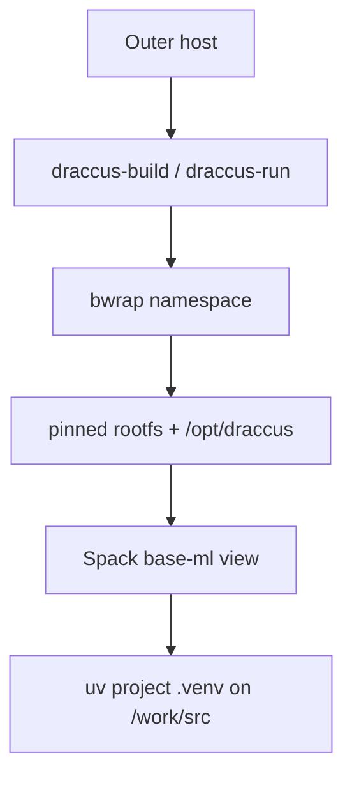

# Draccus: Canonical bwrap + Spack ML Foundation

**Status:** Draft for implementation review (adapted to this repository)  
**Date:** 2026-05-10  
**Primary audience:** AI/ML research engineering, infrastructure engineering, cluster/runtime maintainers  
**System name:** Draccus  
**Canonical runtime prefix:** `/opt/draccus`  

## Repository and bundle root

This directory **is** the Draccus bundle. Physical storage may live anywhere; launchers resolve the bundle root automatically.

| Concept | Location |
|--------|----------|
| **Physical bundle (`DRACCUS_BUNDLE`)** | Directory containing `bin/`, `lib/`, `envs/`, `state/`, … Defaults to the parent of `lib/` via `lib/draccus-env.sh`. Override with `DRACCUS_BUNDLE` if needed. |
| **Canonical prefix inside bwrap** | `/opt/draccus` only — never the host path. |
| **Spack checkout & installs** | Bound from `$DRACCUS_BUNDLE/state/spack` → `/opt/draccus/spack` |
| **Views** | `$DRACCUS_BUNDLE/state/view/{base-sys,base-ml}` → `/opt/draccus/view/...` |
| **Caches / build** | `$DRACCUS_BUNDLE/cache`, `$DRACCUS_BUNDLE/build` |
| **Pinned rootfs** | `$DRACCUS_BUNDLE/rootfs` → `/` inside the namespace |
| **Environment sources (VC)** | `envs/base-sys/spack.yaml`, `envs/base-ml/spack.yaml` (mirror under `/opt/draccus/envs` only after copy/bootstrap; authoritative copies live here in git) |
| **Launchers** | `bin/draccus-run`, `bin/draccus-build`, `bin/draccus-offline`, `bin/draccus-shell`, `bin/draccus-probe` |
| **Rootfs bootstrap** | `scripts/bootstrap-rootfs.sh` (Docker export of `nvidia/cuda:13.1.1-cudnn-devel-ubuntu24.04` by default; set `DRACCUS_ROOTFS_MODE=debootstrap` for legacy Debian bookworm path) |
| **Validation** | `scripts/validate-static.sh` (Gate 0, GPU-free), `scripts/validate-all.sh` (14-gate full suite), and per-gate scripts: `scripts/validate-base-sys.sh`, `scripts/validate-base-ml.sh`, `scripts/validate-project-overlay.sh`, `scripts/validate_foundation.py`, `scripts/validate_uv_layering.sh` |
| **Development enforcement** | `.pre-commit-config.yaml` (shellcheck + shfmt + ruff + Gate 0 on every commit), `CLAUDE.md` (persistent Claude Code session rules) |
| **Bundle resolution helper** | `lib/draccus-env.sh` |

On this checkout, the historical default path `<HOME>/draccus` matches the workspace; **you no longer need to hardcode it** in scripts—set `DRACCUS_BUNDLE` or rely on auto-detection.

---

## 1. Executive summary

Draccus core is three tools working together:

- **bwrap** – mandatory sandbox/namespace (draccus-run, draccus-build, draccus-offline) that presents a stable `/opt/draccus` prefix and pinned rootfs.
- **Spack** – builds and installs the ML foundation layers inside the sandbox (`draccus-build` + `envs/base-ml/spack.yaml` → `base-ml` view). Owns torch, jax, jaxlib, numpy, scipy, CUDA, cuDNN, NCCL, MKL, FFmpeg, etc.
- **uv** – manages upper-level, fast-moving ML libraries in per-project virtualenvs (`uv venv --system-site-packages` + `uv pip install transformers ...`).



Spack and uv never cross layers; validation (`validate_uv_layering.sh`) enforces it.

---

## 2. Baseline and motivation

### 2.1 Problems addressed

| Problem | Mitigation in this repo |
|--------|-------------------------|
| Path instability | Canonical `/opt/draccus` inside bwrap; Spack state under `$DRACCUS_BUNDLE/state` |
| Environment sprawl | Two production envs only: `base-sys`, `base-ml` (`envs/*/spack.yaml`) |
| Over-broad CUDA | CUDA requirements only on CUDA-aware packages in `base-ml`, not `packages:all` |
| Fast Python churn | uv overlay; Spack foundation stays in views |
| Weak runtime contract | Mandatory `draccus-run` / `draccus-build` entrypoints |
| No canonical rootfs | `rootfs/` + `scripts/bootstrap-rootfs.sh` |

### 2.3 Desired logical layout (invariant inside bwrap)

```
/opt/draccus/spack
/opt/draccus/view/base-sys
/opt/draccus/view/base-ml
/opt/draccus/cache/spack
/opt/draccus/cache/uv
/opt/draccus/cache/huggingface
/work/src    <- project (bind from host $DRACCUS_WORK_SRC, default $PWD)
```

---

## 3. Goals, non-goals, assumptions

Aligned with the original EDD: canonical paths; mandatory bwrap; pinned rootfs; Spack for heavy deps; uv for fast Python; mise for orchestration; collapse to `base-sys` + `base-ml`; lockfiles under VC; B200 → `cuda_arch=100`, `TORCH_CUDA_ARCH_LIST=10.0`; Python **3.12** foundation in `base-ml`.

**Non-goals:** Draccus is not an OCI runtime; it does not create GPUs; it does not manage high-level ML Python via Spack.

**Assumptions:** `bwrap` available; GPUs/driver libs exposed by the outer environment when needed; sufficient disk under `$DRACCUS_BUNDLE`.

---

## 4. Architecture overview

### 4.1 Core contract (environment inside bwrap)

Every launcher sets (see `bin/draccus-run`):

- `DRACCUS_PREFIX=/opt/draccus`
- `SPACK_ROOT=/opt/draccus/spack`
- `SPACK_SYS_VIEW`, `SPACK_ML_VIEW`, `DRACCUS_SYS_VIEW`, `DRACCUS_ML_VIEW`
- `SPACK_USER_CACHE_PATH=/opt/draccus/cache/spack`
- `UV_CACHE_DIR=/opt/draccus/cache/uv`
- `HF_HOME=/opt/draccus/cache/huggingface`
- `CUDA_HOME` / `CUDA_ROOT=/opt/draccus/view/base-ml`
- `TORCH_CUDA_ARCH_LIST=10.0`
- `PYTHONNOUSERSITE=1`
- `HOME=/work/src` (project-centric)

### 4.2 Physical layout (this repository)

```
$DRACCUS_BUNDLE/
├── bin/           draccus-run, draccus-build, draccus-offline, draccus-shell, draccus-probe
├── lib/           draccus-env.sh (bundle resolution)
├── rootfs/        pinned distro rootfs (debootstrap)
├── state/
│   ├── spack/     Spack repo + opt tree + environments
│   └── view/base-sys, base-ml
├── cache/spack, uv, huggingface
├── build/stage
├── envs/base-sys/spack.yaml, base-ml/spack.yaml
├── scripts/       bootstrap-rootfs.sh, validate-*.sh, prune-draccus.sh
└── projects/      optional convention for pinned projects
```

### 4.3 Implementation notes (this tree)

- **`draccus-run`** mounts `$DRACCUS_STATE/spack` and `$DRACCUS_STATE/view` **read-only**. **`draccus-build`** binds them **read-write**.
- **DNS / hosts:** When not offline, resolv.conf and hosts are passed with **`--ro-bind-data`** from file descriptors (avoids breakage when the rootfs `/` is read-only).
- **`draccus-offline`** sets `DRACCUS_OFFLINE=1` and execs `draccus-run` (adds `--unshare-net`).
- **`draccus-shell`** runs `draccus-run bash "$@"`.

---

## 5. Design principles

1. **Build where you run** — Bootstrap Spack only inside `draccus-build`.
2. **Spack heavy, uv fast, mise orchestration-only** — Same as EDD §5.2–5.4.
3. **Two environments** — `base-sys` (no CUDA stack), `base-ml` (CUDA + ML).
4. **Never apply CUDA globally** — Only package-specific requires in `envs/base-ml/spack.yaml`.

Source specs in-repo: **`envs/base-sys/spack.yaml`**, **`envs/base-ml/spack.yaml`** (match EDD §8.5–8.6).

---

## uv + Spack Layering (Important Invariant)

Draccus enforces a strict separation:

- **Spack `base-ml`** owns the heavy foundation: `torch`, `jax`, `jaxlib`, `numpy`, `scipy`, CUDA/cuDNN/NCCL, MKL, FFmpeg, etc.
- **uv** only manages fast-moving packages above it: `transformers`, `datasets`, `accelerate`, `peft`, `vllm`, `flash-attn`, etc.

Projects must create venvs with:

```bash
uv venv --python "$(which python)" --system-site-packages .venv
```

The `--system-site-packages` flag allows the venv to see Spack's torch/jax while keeping project packages local.

**Authoritative check**: `scripts/validate_uv_layering.sh` enforces the invariant. It:
- Maintains the single source of truth "do-not-shadow" list (`torch`, `jax`, `jaxlib`, `numpy`, `scipy`, `triton`, `nvidia-*` pip packages).
- Scans for leaked `nvidia-*` pip distributions in the UV venv.
- Provides HARD_FAIL detection for `vllm`/`sglang`/`flash-attn` style packages (ABI / undefined symbol / CUDA library conflicts).

Run with `RUN_HEAVY_INFERENCE=1` to include the heavy inference package tests. Shadowing any foundation package is forbidden and will cause validation to fail.

---

## 6. Launchers

| Mode | Command | Spack writable | Network |
|------|---------|------------------|---------|
| Run | `bin/draccus-run` | No (default) | Yes unless offline |
| Build | `bin/draccus-build` | Yes | Yes |
| Offline | `bin/draccus-offline` | No (default) | No (`--unshare-net`) |

**Device pass-through:** NVIDIA device nodes and `/usr/local/nvidia` when present; `/dev/infiniband` when present.

---

## 7. Bootstrap workflow (summary)

1. **Directories:** `mkdir -p` for `state`, `cache`, `build`, etc. (launchers create needed dirs on each run).
2. **Rootfs:** `./scripts/bootstrap-rootfs.sh` — defaults to Docker mode (exports `nvidia/cuda:13.1.1-cudnn-devel-ubuntu24.04`; requires `docker` and `sudo`). Set `DRACCUS_ROOTFS_MODE=debootstrap` for a plain Debian bookworm rootfs (requires `debootstrap`).
3. **Spack inside Draccus:**  
   `"$DRACCUS_BUNDLE/bin/draccus-build" bash -lc 'git clone https://github.com/spack/spack /opt/draccus/spack && ...'`  
   (Use a pinned Spack commit for production.)
4. **Mirrors:** `spack mirror add`, `spack buildcache keys --install --trust` (inside `draccus-build`).
5. **Environments:**  
   `spack env create base-sys "$DRACCUS_BUNDLE/envs/base-sys/spack.yaml"`  
   `spack env create base-ml "$DRACCUS_BUNDLE/envs/base-ml/spack.yaml"`  
   Then `concretize` / `install` from `draccus-build`.

---

## 8. Validation gates

Run the full suite with `scripts/validate-all.sh` (Gate 0 is always prepended).  
Run Gate 0 alone (GPU-free, ~5 s): `scripts/validate-static.sh` or `mise run draccus-lint`.

| Gate | Script / command | GPU? |
|------|------------------|------|
| **Gate 0** | `scripts/validate-static.sh` — shellcheck, shfmt, ruff, Spack YAML structure, do-not-shadow consistency, rootfs stamp, launcher executability, bwrap probe | No |
| **Gate 1** | `bin/draccus-probe` — namespace / rootfs / path contract | No |
| **Gate 2** | Spack path canonicality + pinned revision (inside `draccus-build`) | No |
| **Gate 3** | `scripts/validate-base-sys.sh` — base-sys tools present and functional | No |
| **Gate 4** | base-ml concretization & pin verification (`py-torch@2.10.0`, `py-jaxlib@0.9.1`, `cuda@13.1.1`, `python@3.12`, `cuda_arch=100`) | No |
| **Gate 5** | GPU device visibility on outer host (informational, non-fatal) | — |
| **Gates 6–9** | `scripts/validate-base-ml.sh` — torch, jax, numpy, scipy, ffmpeg | Yes |
| **Gate 10** | `scripts/validate-project-overlay.sh` — uv overlay contract | Yes |
| **Gate 10b** | `scripts/validate_uv_layering.sh` — nvidia-* scanner + HARD_FAIL; `RUN_HEAVY_INFERENCE=1` for vllm/sglang/flash-attn | Yes |
| **Gate 11** | CUDA extension ABI test, opt-in via `RUN_CUDA_EXT_TEST=1` | Yes |
| **Gate 12** | mise task validation (if `mise.toml` present) | No |
| **Gate 13** | Offline reproducibility (`DRACCUS_OFFLINE=1` imports) | Yes |

Standalone Python-only foundation check: `scripts/validate_foundation.py` (inside `draccus-run` with base-ml active).

---

## 9. mise integration

Use **`DRACCUS_BUNDLE`** in `[env]` or rely on shell-exported bundle root. Example task pattern:

```toml
[env]
DRACCUS_BUNDLE = "/path/to/this/repo"   # or set in shell

[tasks.draccus-shell]
run = '''
"$DRACCUS_BUNDLE/bin/draccus-run" bash -lc "
  . /opt/draccus/spack/share/spack/setup-env.sh
  spack env activate -p base-ml
  source .venv/bin/activate 2>/dev/null || true
  exec bash
"
'''
```

---

## 10. Security and isolation

Draccus is a **reproducibility and path-contract** layer, not a high-assurance sandbox. Read-only Spack/views in run mode; writable project + caches only where bound.

---

## 11. Development enforcement

The repository is a **git repo** with pre-commit hooks wired to Gate 0. All hooks use locally-installed tools — no network access required at commit time.

**Pre-commit hooks** (`.pre-commit-config.yaml`, `language: system`):

| Hook | Tool | Files |
|------|------|-------|
| `shellcheck` | `shellcheck --severity=warning` | `bin/draccus-*`, `scripts/*.sh` |
| `shfmt` | `shfmt -i 2 -ci -bn -d` | same |
| `ruff` | lint + format check | `scripts/*.py` |
| `yamllint` | `.yamllint.yml` config | `*.yaml`/`*.yml` (excl. `spack.yaml`) |
| `draccus-validate-static` | `scripts/validate-static.sh` | always (every commit) |

**Install once:**
```bash
uv tool install pre-commit shellcheck-py ruff yamllint
# shfmt via OS package (apt/brew)
pre-commit install   # wires hooks into .git/hooks/pre-commit
```

**`CLAUDE.md`** at the bundle root encodes the same invariants as persistent instructions for Claude Code sessions: mandatory Gate 0 after any edit, do-not-shadow list, two-layer model, canonical prefix contract, pinned versions.

---

## 12. Acceptance criteria

- `draccus-probe` passes on a host where user namespaces / bwrap are permitted.
- `base-sys` and `base-ml` install and validate per scripts above.
- PyTorch/JAX see GPUs when the outer environment exposes them.
- Foundation imports resolve under `/opt/draccus/`; fast packages under `/work/src/.venv/` after uv overlay.

---

## Appendix A: Open questions (unchanged from EDD)

CPU target (`x86_64_v3` vs `icelake`), rootfs distro flavor, pinned Spack commit, private buildcache — decide per team policy; defaults are reflected in `envs/*/spack.yaml` and `bootstrap-rootfs.sh`.

---

## Appendix B: File index

| EDD concept | File in this repo |
|-------------|-------------------|
| draccus-run / build | `bin/draccus-run`, `bin/draccus-build` |
| draccus-probe | `bin/draccus-probe` |
| Bundle resolution | `lib/draccus-env.sh` |
| base-sys / base-ml specs | `envs/base-sys/spack.yaml`, `envs/base-ml/spack.yaml` |
| Rootfs bootstrap | `scripts/bootstrap-rootfs.sh` |
| Gate 0 static validation | `scripts/validate-static.sh` |
| Full validation suite | `scripts/validate-all.sh` |
| Validation (per gate) | `scripts/validate-base-sys.sh`, `scripts/validate-base-ml.sh`, `scripts/validate-project-overlay.sh`, `scripts/validate_foundation.py`, `scripts/validate_uv_layering.sh` |
| Lockfile refresh | `scripts/refresh-spack-lockfiles.sh` |
| GC / cleanup | `scripts/prune-draccus.sh` |
| Development enforcement | `.pre-commit-config.yaml`, `.shellcheckrc`, `pyproject.toml` (ruff), `.yamllint.yml` |
| Claude Code session rules | `CLAUDE.md` |
