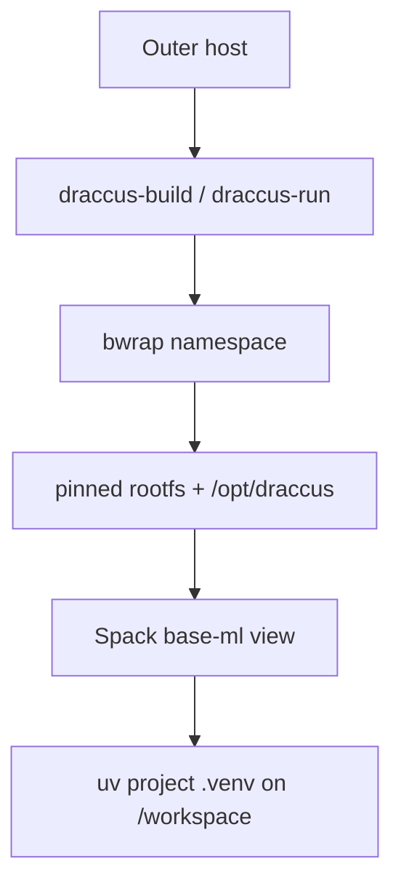

# Draccus

Portable, reproducible, GPU-aware ML foundation using **bubblewrap** + **Spack**.

Draccus gives you stable paths (`/opt/draccus`), a pinned root filesystem, and two Spack environments (`base-sys`, `base-ml`) that never leak the host storage path. Fast-moving Python packages live in per-project `uv` virtualenvs; `mise` handles project tasks.

**Canonical runtime prefix inside the sandbox:** `/opt/draccus`

## Core

Draccus core is three tools working together:

- **bwrap** – mandatory sandbox/namespace (draccus-run, draccus-build, draccus-offline) that presents a stable `/opt/draccus` prefix and pinned rootfs.
- **Spack** – builds and installs the ML foundation layers inside the sandbox (`draccus-build` + `envs/base-ml/spack.yaml` → `base-ml` view). Owns torch, jax, jaxlib, numpy, scipy, CUDA, cuDNN, NCCL, MKL, FFmpeg, etc.
- **uv** – manages upper-level, fast-moving ML libraries in per-project virtualenvs (`uv venv --system-site-packages` + `uv pip install transformers ...`).



Spack and uv never cross layers; validation (`validate_uv_layering.sh`) enforces it.

## uv + Spack Layering Model (Critical)

Draccus uses a strict two-layer Python model:

- **Spack (`base-ml` view)** owns the heavy, compiled, ABI-sensitive foundation:
  - `torch`, `jax`, `jaxlib`, `numpy`, `scipy`
  - CUDA toolkit, cuDNN, NCCL, MKL, MAGMA, FFmpeg, etc.
- **uv** owns only fast-moving, high-churn, project-specific packages on top:
  - `transformers`, `datasets`, `accelerate`, `peft`, `trl`, `tokenizers`, `safetensors`
  - `vllm`, `sglang`, `flash-attn`, `flashinfer`, `xformers`, experiment repos, etc.

### Correct pattern

```bash
DRACCUS_WORKSPACE="$PWD" "$DRACCUS_BUNDLE/bin/draccus-run" bash -lc '
  . /opt/draccus/spack/share/spack/setup-env.sh
  spack env activate -p base-ml
  uv venv --python "$(which python)" --system-site-packages .venv
  source .venv/bin/activate
  uv pip install transformers datasets accelerate peft trl safetensors tokenizers
'
```

**Key points:**

- Always use `--system-site-packages` so the project venv can import the Spack-provided `torch`/`jax`/`numpy`.
- **Never** run `uv pip install torch`, `uv pip install jax`, `uv pip install numpy`, etc. inside a project. Doing so creates a conflicting copy in `.venv` and breaks the foundation.
- The validation scripts (`validate-project-overlay.sh` and `validate_foundation.py`) explicitly assert that foundation packages resolve from `/opt/draccus/view/base-ml`, not from `/workspace/.venv`.

### Do-not-shadow list (enforced by validation)

These packages must always come from Spack (single source of truth in `scripts/validate_uv_layering.sh`):

- `torch`, `jax`, `jaxlib`
- `numpy`, `scipy`
- `triton`
- Any `nvidia-*` pip distribution (unless it originated from the Spack view)

If any of the above resolve from your `.venv` instead of `/opt/draccus`, validation will fail.

Run the full layering checker:
```bash
./scripts/validate_uv_layering.sh
# With optional heavy inference package tests (vLLM, SGLang, flash-attn):
RUN_HEAVY_INFERENCE=1 ./scripts/validate_uv_layering.sh
```

This layering keeps the expensive, version-pinned ML stack stable while still allowing rapid iteration on the Python ecosystem above it.

## Quick Start

### Prerequisites
- `bubblewrap` (`bwrap`) installed and user namespaces enabled
- `debootstrap`, `sudo`, and network access (for initial rootfs)
- NVIDIA driver + devices visible on the outer host when GPU work is needed
- `uv`, `mise` (optional but recommended for project workflows)

### 1. Bootstrap the pinned rootfs
```bash
DRACCUS_BUNDLE="$PWD" ./scripts/bootstrap-rootfs.sh
# or force a fresh one:
DRACCUS_ROOTFS_FORCE=1 ./scripts/bootstrap-rootfs.sh
```

### 2. Clone Spack and build the foundation (inside the namespace)
```bash
# Clone Spack (use a pinned commit in production)
./bin/draccus-build bash -lc '
  git clone https://github.com/spack/spack /opt/draccus/spack
  . /opt/draccus/spack/share/spack/setup-env.sh
  spack mirror add spack-public https://mirror.spack.io || true
  spack buildcache keys --install --trust
'

# Build base-sys (toolchain + dev tools, no CUDA)
./bin/draccus-build bash -lc '
  . /opt/draccus/spack/share/spack/setup-env.sh
  spack env create base-sys envs/base-sys/spack.yaml
  spack -e base-sys concretize -f
  spack -e base-sys install --fail-fast -j32
'

# Build base-ml (CUDA, PyTorch, JAX, FFmpeg, etc.)
./bin/draccus-build bash -lc '
  . /opt/draccus/spack/share/spack/setup-env.sh
  spack env create base-ml envs/base-ml/spack.yaml
  spack -e base-ml concretize -f
  spack -e base-ml install --fail-fast -j32
'
```

### 3. Validate
```bash
./bin/draccus-probe
./scripts/validate-base-sys.sh
./scripts/validate-base-ml.sh
./scripts/validate-project-overlay.sh   # after creating a .venv
```

### 4. First project (uv overlay on top of Spack foundation)
```bash
mkdir -p projects/my-experiment && cd projects/my-experiment
DRACCUS_WORKSPACE="$PWD" ../bin/draccus-run bash -lc '
  . /opt/draccus/spack/share/spack/setup-env.sh
  spack env activate -p base-ml
  uv venv --python "$(which python)" --system-site-packages .venv
  source .venv/bin/activate
  uv pip install transformers datasets accelerate safetensors tokenizers
  python -c "
import torch, jax, numpy, transformers
print('torch:', torch.__file__)
print('transformers:', transformers.__file__)
print('CUDA available:', torch.cuda.is_available())
"
'
```

## Directory Layout

```
$DRACCUS_BUNDLE/
├── bin/                 # draccus-run, draccus-build, draccus-offline, draccus-shell, draccus-probe
├── lib/draccus-env.sh   # portable bundle root resolver (sourced by all scripts)
├── rootfs/              # pinned Debian root filesystem
├── state/
│   ├── spack/           # Spack installation + environments
│   └── view/            # base-sys and base-ml views
├── cache/               # spack, uv, huggingface caches
├── build/stage          # Spack build stages
├── envs/                # source-of-truth spack.yaml files (base-sys, base-ml)
├── scripts/             # bootstrap, validation, prune
└── projects/            # optional location for pinned experiments
```

All paths inside the bwrap namespace are stable at `/opt/draccus/...` and `/workspace`.

## Common Commands

| Command | Purpose |
|---------|---------|
| `bin/draccus-run ...` | Run workloads (read-only Spack/views) |
| `bin/draccus-build ...` | Build / update Spack environments (writable) |
| `bin/draccus-offline ...` | Same as run but with `--unshare-net` |
| `bin/draccus-shell` | Interactive shell inside the namespace |
| `bin/draccus-probe` | Quick sanity check of namespace + paths |
| `scripts/validate-*.sh` | Run specific validation gates |
| `scripts/prune-draccus.sh` | `spack gc` + cache cleanup |

## Design & Reference

- Full Engineering Design Document: `DESIGN.md`
- Original EDD (detailed requirements): see the source document that produced this repo
- Validation gates: EDD §12 / `scripts/validate-*`
- Spack environments: `envs/base-sys/spack.yaml`, `envs/base-ml/spack.yaml`

## Troubleshooting

**"bwrap: setting up uid map: Operation not permitted"**  
User namespaces are disabled. On many systems:
```bash
sudo sysctl kernel.unprivileged_userns_clone=1
# or for Debian/Ubuntu:
sudo sysctl kernel.apparmor_restrict_unprivileged_userns=0
```
Re-run `draccus-probe` after the change.

**Rootfs missing or incomplete**  
Re-run the bootstrap script with `DRACCUS_ROOTFS_FORCE=1`.

**No GPUs visible inside Draccus**  
Ensure the outer host/container exposes `/dev/nvidia*` and NVIDIA driver libraries. Draccus only passes through what the outer environment provides.

For deeper diagnostics, run:
```bash
./bin/draccus-run bash -lc 'nvidia-smi || true; python -c "import torch; print(torch.cuda.is_available())"'
```

## License & Status

Internal engineering foundation. Status: implementation complete, awaiting final validation on target hardware.