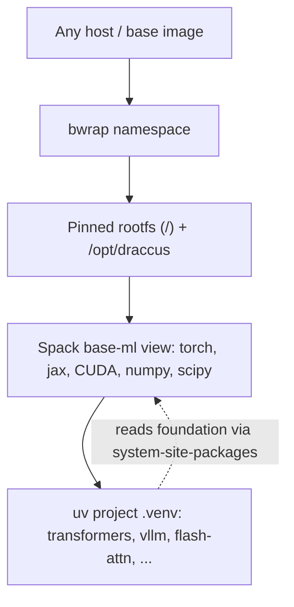

# Draccus

Distraction-free ML development, from your devbox to 1000 GPUs.

## The problem

Production base images are controlled by infra teams who optimize for Kubernetes, not for ML. They ship stale compilers, wrong CUDA, missing libraries. You can't fix the base image, and you shouldn't have to.

Draccus layers a pinned, hermetic ML environment **on top of any base image** using [bubblewrap](https://github.com/containers/bubblewrap) -- a userland namespace tool that needs no root, no daemon, and no changes to the host. Your torch/jax code runs identically from an interactive session on your devbox to a distributed training job across 1000 GPUs.

## Try it

```bash
./bin/draccus-shell
```

```python
import torch, jax
print(torch.cuda.is_available())
print(jax.devices())
```

That's it. `python` is the foundation ML interpreter with torch, jax, numpy, scipy, CUDA, cuDNN, and NCCL -- all built from source into a single coherent ABI graph.

## The guarantee

- **Stable prefix.** Inside the sandbox, the ML foundation always lives at `/opt/draccus`, on a pinned rootfs, regardless of where the bundle sits on disk or what base image you're running on.
- **Dependencies are sacred artifacts.** The ML foundation (torch, jax, CUDA, numpy, scipy) is audited and pinned with the same rigor as your datasets and model checkpoints. It does not drift, and nothing in your project can accidentally shadow it.
- **Dev-prod parity.** `draccus-shell` on your devbox and `draccus-run` on 1000 nodes use the same sandbox, the same paths, the same libraries. If it works locally, it works at scale.

## Three tools you use every day

| Tool | What it does |
|------|-------------|
| `draccus-shell` | Interactive ML sandbox -- `python` is torch/jax-ready out of the box |
| `draccus-run <cmd>` | Run any command inside the sandbox (training scripts, inference, CI) |
| `draccus-uv <uv-args>` | Add and manage fast-moving Python packages on top of the foundation |

`pip` is intentionally not listed: bare `pip` / `pip3` are shimmed to fail fast inside the sandbox; use `draccus-uv pip …` instead.

## Adding packages with `draccus-uv`

The foundation (torch, jax, CUDA, numpy, scipy) is built by Spack and lives in the read-only base-ml view. Everything else -- transformers, datasets, accelerate, flash-attn, vllm, your experiment code -- lives in a per-project uv virtualenv layered on top.

### Create a project environment

```bash
cd /workspace/my-experiment

# Create a venv that inherits the foundation via --system-site-packages
draccus-uv venv --python "$(which python)" --system-site-packages .venv
source .venv/bin/activate

# Install fast-moving packages
draccus-uv pip install transformers datasets accelerate peft trl safetensors
```

If `.venv` does not exist yet, `draccus-uv pip install ...` creates it with the canonical `--system-site-packages` layout before installing. It never installs project packages into the read-only foundation view.

Inside `draccus-shell` or `draccus-run`, the `draccus-uv` wrapper is available as plain `uv` with all protections active. `draccus-shell` starts a controlled zsh session, sources Spack's shell setup, activates the read-only `base-ml` environment by default, activates the workspace `.venv` when it exists, and uses Starship to show the active Spack and uv environments in the prompt.

### The do-not-shadow rule

These packages must **always** come from the Spack foundation, never from pip:

- `torch`, `jax`, `jaxlib`, `numpy`, `scipy`, `triton`
- Any `nvidia-*` pip distribution

`draccus-uv` enforces this structurally before mutation: direct requirements are checked, the resolved install plan is audited, and Gate 10b scans venv provenance. The authoritative list lives in `scripts/validate_uv_layering.sh`.

### Debugging dependency conflicts

When a package you need requires a different version of a foundation package (e.g., `flash-attn` wants `torch>=2.11` but the foundation ships `torch 2.10`):

1. **Short-term:** Pin a compatible version of the conflicting package. `draccus-uv pip install 'flash-attn==2.7.0'` (find the version that works with your foundation torch).
2. **Escalate:** If no compatible version exists, request a foundation version bump. The pinned versions are a team decision -- they affect everyone's reproducibility.

### Verify your layering

```bash
./scripts/validate_uv_layering.sh

# Include heavy inference packages (vLLM, SGLang, flash-attn):
RUN_HEAVY_INFERENCE=1 ./scripts/validate_uv_layering.sh
```

Foundation packages must resolve from `/opt/draccus/view/base-ml`, not from `.venv`. If they don't, validation fails.

## How it works

There is no false dichotomy between ML researchers and systems engineers. Everyone benefits from understanding the machinery.

### Three tools, strict layers



**bwrap** (bubblewrap) creates a filesystem namespace: it remaps your bundle directory to `/opt/draccus` and overlays a pinned rootfs as `/`, all in userland. No root, no daemon, works inside containers you don't control. GPU devices and NVIDIA driver libraries are passed through from the host.

**Spack** builds the heavy, ABI-coupled ML foundation inside the sandbox: CUDA, cuDNN, NCCL, MKL, FFmpeg, torch, jax, numpy, scipy -- compiled into a unified dependency graph targeting your hardware. The result is a flat "view" directory at `/opt/draccus/view/base-ml` that looks like `/usr/local` to consumers. Spack is mounted **read-only** in `draccus-run` -- the foundation is immutable at runtime.

**uv** manages fast-moving, project-specific packages in per-project `.venv` directories. `--system-site-packages` lets the venv see the Spack foundation without copying it. `UV_EXTRA_OVERRIDES` prevents uv from ever installing foundation packages from PyPI. This is what keeps the two layers cleanly separated.

### The two launchers

| Launcher | Spack tree | Use for |
|----------|-----------|---------|
| `draccus-run` | Read-only | Daily work: training, inference, validation |
| `draccus-build` | Read-write | Building/updating Spack environments |

`draccus-shell` is `draccus-run bash` with ML-first `PATH`. `draccus-debug-shell` is the same sandbox with base-sys before base-ml on `PATH` (for infra/toolchain work).

## Commands reference

| Command | Purpose |
|---------|---------|
| `bin/draccus-shell` | Interactive ML sandbox |
| `bin/draccus-run <cmd>` | Run a command in the sandbox (read-only foundation) |
| `bin/draccus-uv <args>` | uv with layering protection (preferred way to manage packages) |
| `bin/draccus-build <cmd>` | Run a command with writable Spack (for building/updating foundation) |
| `bin/draccus-offline <cmd>` | Same as run, but with no network (`--unshare-net`) |
| `bin/draccus-debug-shell` | Interactive shell with base-sys before base-ml on `PATH` |
| `bin/draccus-probe` | Quick sanity check of namespace + paths |
| `scripts/validate-static.sh` | Gate 0: static checks, no GPU needed |
| `scripts/validate-all.sh` | Full 14-gate validation (GPU required) |

## Building and updating the bundle

This section is for setting up or rebuilding the Draccus foundation. Most researchers receive a pre-built bundle and skip straight to `draccus-shell`.

### Prerequisites

- `bubblewrap` (`bwrap`) installed and user namespaces enabled
- `docker` and `sudo` (for rootfs bootstrap)
- NVIDIA driver + devices visible on the host (for GPU work)
- `curl` on the bootstrap host (used to fetch the pinned `uv` binary into `rootfs/`)

### 1. Bootstrap the pinned rootfs

```bash
DRACCUS_BUNDLE="$PWD" ./scripts/bootstrap-rootfs.sh
```

### 2. Clone Spack and build the foundation

```bash
# Clone Spack (inside the writable sandbox)
./bin/draccus-build bash -lc '
  git clone https://github.com/spack/spack /opt/draccus/spack
  . /opt/draccus/spack/share/spack/setup-env.sh
  spack mirror add spack-public https://mirror.spack.io || true
  spack buildcache keys --install --trust
'

# Build base-sys (toolchain, no CUDA)
./bin/draccus-build bash -lc '
  . /opt/draccus/spack/share/spack/setup-env.sh
  spack env create base-sys envs/base-sys/spack.yaml
  spack -e base-sys concretize -f
  spack -e base-sys install --fail-fast -j$(nproc)
'

# Build base-ml (CUDA, PyTorch, JAX, FFmpeg, etc.)
./bin/draccus-build bash -lc '
  . /opt/draccus/spack/share/spack/setup-env.sh
  spack env create base-ml envs/base-ml/spack.yaml
  spack -e base-ml concretize -f
  spack -e base-ml install --fail-fast -j$(nproc)
'
```

### 3. Validate

```bash
./bin/draccus-probe
./scripts/validate-base-sys.sh
./scripts/validate-base-ml.sh
```

## Directory layout

```
$DRACCUS_BUNDLE/
├── bin/                 # draccus-run, draccus-build, draccus-shell, draccus-uv, draccus-probe, ...
├── shims/               # pip/pip3 shims mounted at /opt/draccus/shims inside the namespace
├── lib/                 # draccus-env.sh (portable bundle resolver), bwrap helpers
├── rootfs/              # pinned root filesystem (from Docker export)
├── state/
│   ├── spack/           # Spack installation + environments
│   └── view/            # base-sys and base-ml flattened views
├── cache/               # spack, uv, huggingface caches
├── build/stage           # Spack build scratch
├── envs/                # source-of-truth spack.yaml files (base-sys, base-ml)
├── scripts/             # bootstrap, validation, prune
└── projects/            # optional: per-project experiment directories
```

All paths inside the sandbox are stable at `/opt/draccus/...` and `/workspace`.

## Appendix: current pinned versions

| Component | Version | Notes |
|-----------|---------|-------|
| uv (static binary) | 0.11.13 | Installed to `rootfs/usr/local/bin/uv`; pin in `scripts/uv-version.env` |
| CUDA | 13.1.1 | Matches rootfs Docker tag |
| cuDNN | 9.17+ | |
| NCCL | 2.29+ | |
| PyTorch | 2.10.0 | `+cuda +cudnn +nccl ~magma +distributed cuda_arch=100` |
| JAX | 0.9.1 | `+cuda cuda_arch=100` |
| jaxlib | 0.9.1 | `+cuda cuda_arch=100` |
| Python | 3.12 | Foundation interpreter in base-ml view |
| Target arch | `cuda_arch=100` / `TORCH_CUDA_ARCH_LIST=10.0` | NVIDIA B200 (SM 10.0) |

These versions are pinned in `envs/base-ml/spack.yaml`. Changing them requires a Spack rebuild and team sign-off.

## Troubleshooting

**"bwrap: setting up uid map: Operation not permitted"**
User namespaces are disabled. On many systems:
```bash
sudo sysctl kernel.unprivileged_userns_clone=1
# or for Debian/Ubuntu:
sudo sysctl kernel.apparmor_restrict_unprivileged_userns=0
```

**No GPUs visible inside Draccus**
Draccus passes through GPU devices from the host. Ensure `/dev/nvidia*` and NVIDIA driver libraries are visible on the outer host/container.

```bash
./bin/draccus-run bash -lc 'nvidia-smi || true; python -c "import torch; print(torch.cuda.is_available())"'
```

**Rootfs missing or incomplete**
Re-run `DRACCUS_ROOTFS_FORCE=1 ./scripts/bootstrap-rootfs.sh`.

**`sys.path` shows long `__spack_path_placeholder__` paths**
Normal. Spack pads install prefixes to a fixed width (`padded_length: 128` in `spack.yaml`) so compiled binaries can be relocated via buildcache without recompilation. The Python binary has its real Spack install prefix baked in, so `sys.path` shows paths like `/opt/draccus/spack/opt/spack/__spack_path_placeholder__/.../python-3.12.13-.../lib/python3.12`. What matters: the **view site-packages** (`/opt/draccus/view/base-ml/lib/python3.12/site-packages`) is always on `sys.path`, and that is where `import torch` / `jax` / `numpy` resolve from. The padded paths are a Spack implementation detail you never interact with directly.

**`spack env activate` fails with "Read-only file system"**
Expected for mutating Spack operations. `draccus-shell` already sources Spack's `setup-env.sh`, and `PATH` points at the base-ml view plus `/opt/draccus/spack/bin`. Read-only inspection commands such as `spack find` run with locks disabled via `/opt/draccus/cache/spack-readonly-config`. `spack env activate <managed-env>` activates a writable metadata mirror under `/opt/draccus/cache/spack-readonly-envs`, while the package tree and views still come from the immutable foundation. Use `draccus-build` when Spack must write (install, concretize, etc.).

## Design & reference

- Full engineering design: `DESIGN.md`
- Tech blog walkthrough: `docs/tech-blog-hello-draccus.md`
- Validation gates: `scripts/validate-*`
- Spack environment specs: `envs/base-sys/spack.yaml`, `envs/base-ml/spack.yaml`
