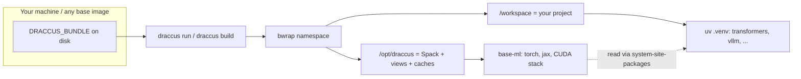

# Hello, Draccus: a practical tour (tech blog)

*A readable walkthrough for ML engineers who want to run GPU code in a reproducible sandbox without re-learning the whole README in one sitting.*

---

## How to use this post

Think of this document as a **linear tutorial** and a **bookmark list**:

| Section | Read when you want to... |
|---------|-------------------------|
| [The problem](#why-draccus-exists) | Motivate *why* paths and layers exist. |
| [The shape of the system](#the-shape-of-the-system) | Picture bwrap + Spack + uv before typing commands. |
| [Your first interactive shell](#your-first-interactive-shell) | Get a REPL inside the namespace. |
| [Run one command](#run-one-command-without-a-shell) | Script or CI style: one-off `draccus run`. |
| [Project Python with uv](#project-python-with-uv) | Add `transformers`, etc. without shadowing torch. |
| [Trust but verify](#trust-but-verify-validation) | Run Gate 0 / full suite after changes. |
| [When things break](#when-things-break) | Pointers to deeper docs and common pitfalls. |

**You do not need to read top to bottom in one sitting.** Jump via the table, copy commands into your terminal, and come back when you change something in `bin/`, `lib/`, `scripts/`, or `envs/`.

---

## Why Draccus exists

Production base images are controlled by infra teams who optimize for Kubernetes, not for ML. They ship stale compilers, wrong CUDA, missing libraries. You can't fix the base image, and you shouldn't have to.

Draccus layers a pinned ML environment **on top of any base image** using **bubblewrap** (userland namespace, no root, no daemon). Everything heavy and CUDA-linked lives under **`/opt/draccus`** (bound from your bundle's `state/` on disk). Your project stays on **`/workspace`**. One promise: **foundation packages resolve from the Spack ML view, not from a rogue pip wheel in `.venv`**. If it works in `draccus shell` on your devbox, it works the same way at 1000 GPUs.

---

## The shape of the system



**Three tools you use every day:**

| Tool | What it does |
|------|-------------|
| `./bin/draccus shell` | Interactive ML sandbox -- `python` is torch/jax-ready |
| `./bin/draccus run -- <cmd>` | Run any command in the sandbox (training, inference, CI) |
| `./bin/draccus uv <args>` | Add/manage fast-moving Python packages on top of the foundation |

For building/updating the foundation itself, use `draccus build` (writable Spack).

**Two-layer Python:**

- **Spack `base-ml` view** owns `torch`, `jax`, `jaxlib`, `numpy`, `scipy`, `triton`, and anything `nvidia-*` that must match CUDA.
- **uv** (via `draccus uv`) owns fast-moving packages (`transformers`, `datasets`, ...) in a project **`.venv`** created with **`--system-site-packages`** so it *sees* Spack's `site-packages` without replacing them.

Authoritative lists and checks live in **`scripts/validate_uv_layering.sh`** and **`scripts/uv_overrides.txt`**.

---

## Your first interactive shell

From the **bundle root** (the directory that contains `bin/` and `lib/`):

```bash
./bin/draccus shell
```

That drops you into `bash` **inside** the namespace with **`/opt/draccus`** and **`/workspace`** set up. Quick sanity:

```bash
which python
python -c "import torch; print(torch.__version__, torch.cuda.is_available())"
```

You should see Python from **`/opt/draccus/view/base-ml/bin/python`** and CUDA available when GPUs and drivers are wired correctly on the host. No `spack env activate` needed -- `PATH` already points at the ML foundation by default.

---

## Run one command without a shell

Non-interactive pattern (good for scripts):

```bash
DRACCUS_BUNDLE="$(pwd)" ./bin/draccus run -- bash -lc 'python -c "import torch; print(torch.cuda.device_count())"'
```

Override **`DRACCUS_BUNDLE`** if your checkout is not auto-detected. The **`bash -lc`** form matches what validation scripts and CI use.

**Offline / air-gap style** (no network inside the namespace):

```bash
DRACCUS_OFFLINE=1 ./bin/draccus run -- bash -lc 'python -c "import torch"'
```

---

## Project Python with uv

**Goal:** a `.venv` that installs Hugging Face stacks (and similar) **without** installing `torch`/`jax`/`numpy` from PyPI.

From the bundle root, use **`./bin/draccus uv`** (the canonical uv entrypoint with layering protection):

```bash
# Create a venv that inherits the foundation
./bin/draccus uv venv --python "$(which python)" --system-site-packages .venv

# Inside ./bin/draccus shell or ./bin/draccus run:
source .venv/bin/activate
./bin/draccus uv pip install transformers datasets accelerate
python -c "import torch, transformers; print(torch.__file__)"
```

The last line should show **`torch` loading from** **`/opt/draccus/view/base-ml/...`**, not from `.venv`.

`draccus uv` enforces `UV_EXTRA_OVERRIDES` so the uv resolver **cannot** install foundation packages (`torch`, `jax`, `numpy`, `scipy`, `triton`) from PyPI. The authoritative list lives in `scripts/uv_overrides.txt`.

---

## Trust but verify (validation)

**Fast, no GPU required** (run after editing `bin/`, `lib/`, `scripts/`, `envs/`, or `mise.toml` per project rules):

```bash
./scripts/validate-static.sh
```

**Full acceptance** (needs GPU host aligned with your pins, e.g. B200 in this repo):

```bash
./scripts/validate-all.sh
```

Targeted checks:

```bash
./scripts/validate-base-ml.sh
./scripts/validate-project-overlay.sh
./scripts/validate_uv_layering.sh
```

Offline import probe (must not hit the network):

```bash
DRACCUS_OFFLINE=1 ./bin/draccus run -- bash -lc 'python /workspace/scripts/validate_foundation.py'
```

`PATH` already points at the ML view by default -- no `spack env activate` needed inside `draccus run`.

---

## When things break

1. **`torch` missing or wrong file path**
   Confirm you are inside **`draccus run`** or **`draccus shell`**. `PATH` should already prefer **`/opt/draccus/view/base-ml/bin`** by default. If using a project `.venv`, verify `torch` resolves from the foundation, not from `.venv/lib/`.

2. **`spack env activate` fails with "Read-only file system"**
   Expected. Spack is mounted read-only in `draccus run` / `draccus shell`. You do not need Spack shell activation for daily work -- `PATH` already points at the ML view. Use **`draccus build`** when Spack must write (install, concretize, etc.).

3. **`sys.path` shows long `__spack_path_placeholder__` paths**
   Normal. Spack pads install prefixes for binary relocation (`padded_length: 128`). The Python binary has its real Spack prefix baked in, so `sys.path` includes those padded paths. What matters: `/opt/draccus/view/base-ml/lib/python3.12/site-packages` is always on `sys.path`, and that is where `import torch` / `jax` resolve from. You never interact with the padded paths directly.

4. **Deeper design and bootstrap history**
   - **`DESIGN.md`** -- architecture and validation gates.
   - **`README.md`** -- canonical commands and invariants.
   - **`.workstream/spack-envs-bootstrap/`** -- how the pinned Spack environments were bootstrapped on a reference host (logs and lessons learned).

---

## Closing

Draccus is intentionally **boring at the boundary**: stable paths, one foundation graph, strict layering. This post is meant to get you **productive first**, then send you to **`README.md` / `DESIGN.md`** when you need exact invariants and gate semantics.

If you maintain this repo: treat this file as a **narrative companion**; when behavior changes, update **commands here** to match **`README.md`**, not the other way around.
